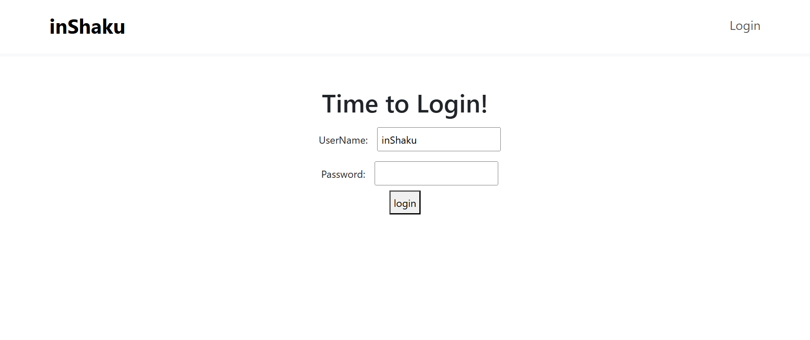
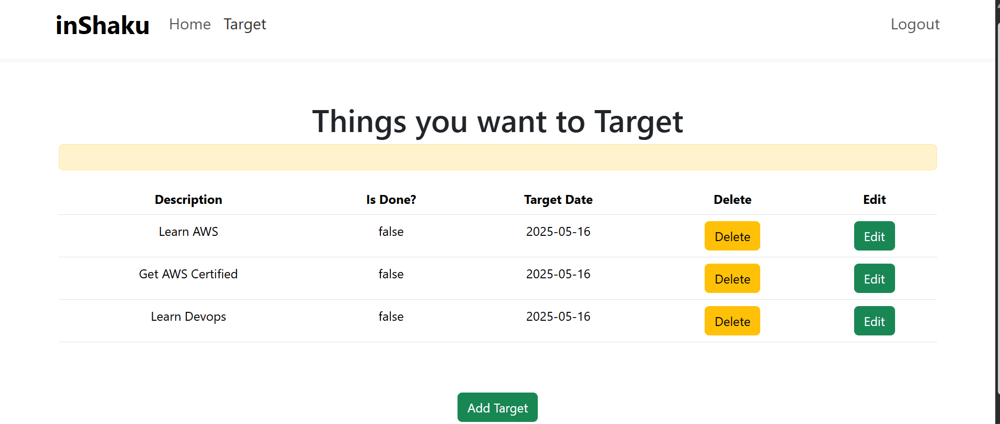
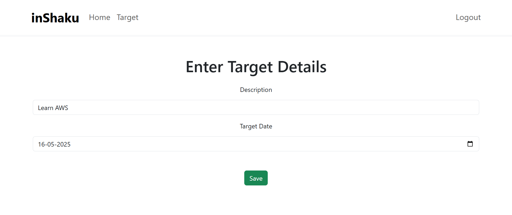

# Target List 🎯

A full-stack task management app designed to help users organize and track their daily tasks efficiently.  
The backend is built using Spring Boot with RESTful APIs, and the frontend uses React.js for a dynamic user experience.  
Users can create, update, and delete tasks, set deadlines, and receive notifications for important reminders.

## 📸 App Screenshots

### 🔐 Login Page

### 🏠 Dashboard

### 📝 Create Task

## 🚀 Tech Stack

- Java + Spring Boot  
- React.js  
- MySQL  

## Features

- User authentication and login system  
- Create, read, update, and delete tasks (CRUD)  
- Task categorization and status tracking  
- Responsive and user-friendly interface  
- Notification system to remind users about deadlines  
